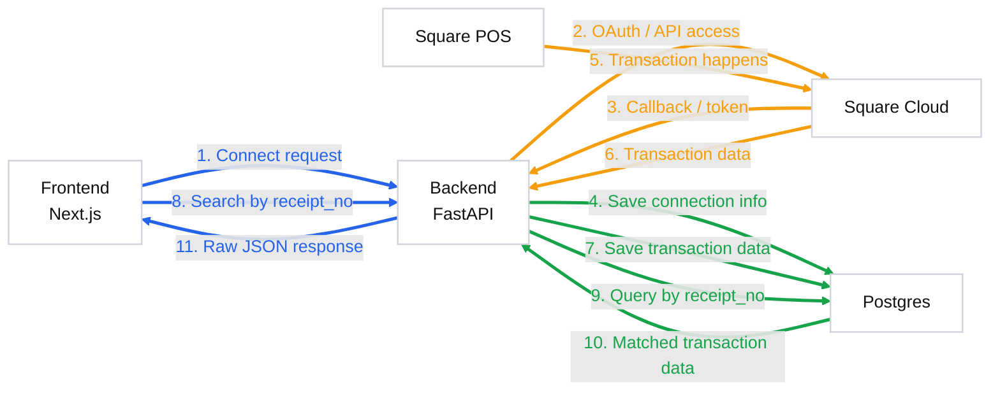
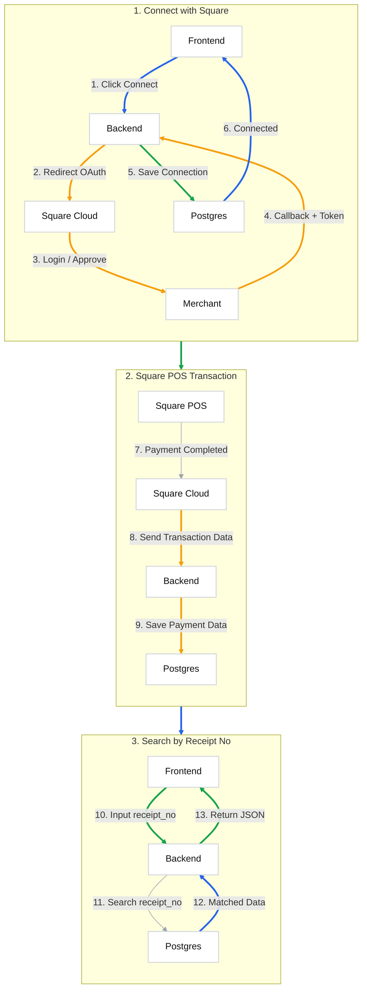

```mermaid
flowchart LR

%% ---------- NODE STYLE ----------
classDef node fill:#ffffff,stroke:#d1d5db,stroke-width:1.5px,color:#111;

A["Frontend<br/>Next.js"]
B["Backend<br/>FastAPI"]
C["Square Cloud"]
D["Postgres"]
E["Square POS"]

class A,B,C,D,E node

%% ---------- FLOWS ----------
A -->|"1. Connect request"| B
linkStyle 0 stroke:#2563eb,stroke-width:3px,color:#2563eb

B -->|"2. OAuth / API access"| C
linkStyle 1 stroke:#f59e0b,stroke-width:3px,color:#f59e0b

C -->|"3. Callback / token"| B
linkStyle 2 stroke:#f59e0b,stroke-width:3px,color:#f59e0b

B -->|"4. Save connection info"| D
linkStyle 3 stroke:#16a34a,stroke-width:3px,color:#16a34a

E -->|"5. Transaction happens"| C
linkStyle 4 stroke:#f59e0b,stroke-width:3px,color:#f59e0b

C -->|"6. Transaction data"| B
linkStyle 5 stroke:#f59e0b,stroke-width:3px,color:#f59e0b

B -->|"7. Save transaction data"| D
linkStyle 6 stroke:#16a34a,stroke-width:3px,color:#16a34a

A -->|"8. Search by receipt_no"| B
linkStyle 7 stroke:#2563eb,stroke-width:3px,color:#2563eb

B -->|"9. Query by receipt_no"| D
linkStyle 8 stroke:#16a34a,stroke-width:3px,color:#16a34a

D -->|"10. Matched transaction data"| B
linkStyle 9 stroke:#16a34a,stroke-width:3px,color:#16a34a

B -->|"11. Raw JSON response"| A
linkStyle 10 stroke:#2563eb,stroke-width:3px,color:#2563eb
```

```mermaid
flowchart TD

%% =========================
%% STYLE
%% =========================
classDef node fill:#ffffff,stroke:#d1d5db,stroke-width:1.5px,color:#111;

%% =========================
%% 1 CONNECT FLOW
%% =========================
subgraph A["1. Connect with Square"]
direction TD
A1["Frontend"] -->|"1. Click Connect"| A2["Backend"]
A2 -->|"2. Redirect OAuth"| A3["Square Cloud"]
A3 -->|"3. Login / Approve"| A4["Merchant"]
A4 -->|"4. Callback + Token"| A2
A2 -->|"5. Save Connection"| A5["Postgres"]
A5 -->|"6. Connected"| A1
end

%% =========================
%% 2 POS FLOW
%% =========================
subgraph B["2. Square POS Transaction"]
direction TD
B1["Square POS"] -->|"7. Payment Completed"| B2["Square Cloud"]
B2 -->|"8. Send Transaction Data"| B3["Backend"]
B3 -->|"9. Save Payment Data"| B4["Postgres"]
end

%% =========================
%% 3 SEARCH FLOW
%% =========================
subgraph C["3. Search by Receipt No"]
direction TD
C1["Frontend"] -->|"10. Input receipt_no"| C2["Backend"]
C2 -->|"11. Search receipt_no"| C3["Postgres"]
C3 -->|"12. Matched Data"| C2
C2 -->|"13. Return JSON"| C1
end

%% =========================
%% STACK VERTICALLY
%% =========================
A --> B --> C

%% =========================
%% NODE STYLE
%% =========================
class A1,A2,A3,A4,A5,B1,B2,B3,B4,C1,C2,C3 node

%% =========================
%% LINK COLORS
%% Blue = Frontend
%% Orange = Square
%% Green = DB
%% =========================
linkStyle 0 stroke:#2563eb,stroke-width:3px
linkStyle 1 stroke:#f59e0b,stroke-width:3px
linkStyle 2 stroke:#f59e0b,stroke-width:3px
linkStyle 3 stroke:#f59e0b,stroke-width:3px
linkStyle 4 stroke:#16a34a,stroke-width:3px
linkStyle 5 stroke:#2563eb,stroke-width:3px

linkStyle 6 stroke:#9ca3af,stroke-width:1px

linkStyle 7 stroke:#f59e0b,stroke-width:3px
linkStyle 8 stroke:#f59e0b,stroke-width:3px
linkStyle 9 stroke:#16a34a,stroke-width:3px

linkStyle 10 stroke:#9ca3af,stroke-width:1px

linkStyle 11 stroke:#2563eb,stroke-width:3px
linkStyle 12 stroke:#16a34a,stroke-width:3px
linkStyle 13 stroke:#16a34a,stroke-width:3px
linkStyle 14 stroke:#2563eb,stroke-width:3px
```
