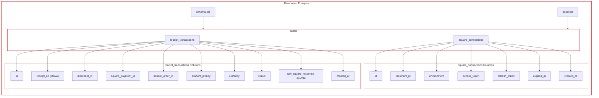

## Frontend Project
```bash
frontend/
├─ app/
│  ├─ layout.tsx
│  ├─ page.tsx
│  ├─ globals.css
│  └─ api/
│     └─ health/
│        └─ route.ts
│
├─ components/
│  ├─ ui/
│  │  └─ ...shadcn components
│  │
│  ├─ square-connect-card.tsx
│  ├─ receipt-search-card.tsx
│  ├─ json-result-viewer.tsx
│  └─ page-header.tsx
│
├─ lib/
│  ├─ api.ts
│  ├─ constants.ts
│  ├─ utils.ts
│  └─ types.ts
│
├─ public/
│
├─ Dockerfile
├─ docker-compose.yml
├─ package.json
├─ tsconfig.json
├─ next.config.ts
└─ .env.local

```

## Backend Project
```bash
backend/
├─ app/
│  ├─ main.py
│  │
│  ├─ api/
│  │  ├─ square.py
│  │  ├─ receipts.py
│  │  └─ health.py
│  │
│  ├─ models/
│  │  ├─ square_connection.py
│  │  └─ receipt_transaction.py
│  │
│  ├─ schemas/
│  │  ├─ square.py
│  │  └─ receipt.py
│  │
│  ├─ services/
│  │  ├─ square_oauth.py
│  │  ├─ square_transactions.py
│  │  └─ receipt_service.py
│  │
│  ├─ db/
│  │  ├─ session.py
│  │  ├─ base.py
│  │  └─ init_db.py
│  │
│  └─ core/
│     └─ config.py
│
├─ requirements.txt
├─ Dockerfile
├─ docker-compose.yml
└─ .env

```



